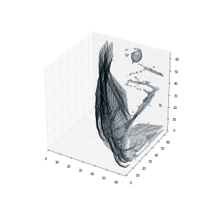
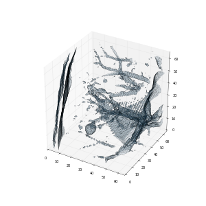
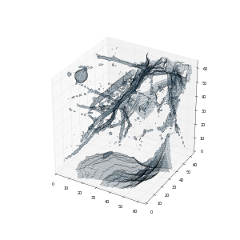
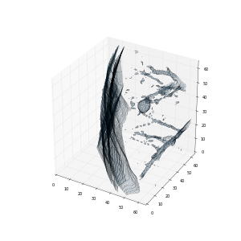
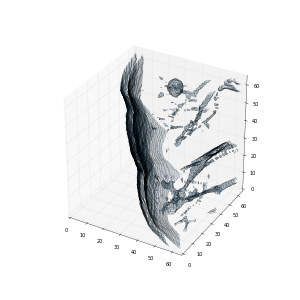
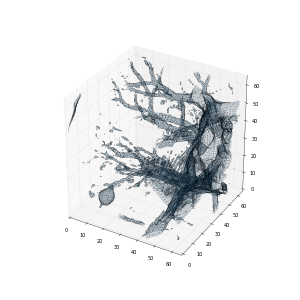
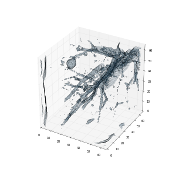
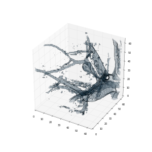

# Data Science Bowl 2017

## Description

This code is for training a 3D Convolutional Neural Network on the [LUNA16](https://luna16.grand-challenge.org/home/) dataset in order to detect malignant nodules. I am hopeful that this can be used as the first step towards solving the [DSB 2017 challenge](https://www.kaggle.com/c/data-science-bowl-2017).

#### What it does

As given, the code does not make predictions on the DSB dataset provided by Kaggle. What it does do is build a model to predict the probability that a 64mm x 64mm x 64mm chunk of tissue contains a malignant nodule. The model is trained on the LUNA16 dataset, which includes labels that identify nodule locations in 3D space. The DSB dataset on the other hand, comes with binary labels and is not suitable for training such a model (using LUNA16 data is allowed per the contest rules).

During data preparation, the images are converted to 3D data and segmented to eliminate non-lung tissue. The segmentation algorithm used is rather simplistic and in fact fails in about 10% of the cases. The entire image is used when a segmentation failure is detected.

During training, chunks are extracted based on the coordinates given in `annotations_excluded.csv` (this has both positive and negative locations). Dimension shuffling is used randomly to augment the training set. To minimize overfitting further, some amount of jitter is applied to the coordinates.

Here's a visualization of the first eight chunks extracted from the first sample in the training set (it is quite easy to spot the nodule).

|            |              |            |          |
|------------|--------------|------------|----------|
| |  |   |   |
| |  |   |   |

The chunks can be downloaded in video form from the [`visuals`](visuals) directory. The file [`train-vid.avi`](visuals/train-vid.avi) contains the entire 3D sample from which the above chunks were obtained. Since this is a positive sample, all of the chunks derived from it are assigned a label of 1. A label of 0 is assigned to all chunks extracted from negative samples. 80% of the training set is thus used to train the network to perform a binary classification. The model is validated on the rest of the data and a log loss of **0.3080** is observed after six epochs of training.

#### Where to go from here

Once you have trained a model by following the recipe given in the `Usage` section below, there are a couple of possible ways to proceed with the DSB challenge.

1) If you already have a system to detect locations of possible candidates, you can feed chunks from those locations to the trained model in order to get predictions. Before you submit the predictions to Kaggle, they need to be calibrated to match the distribution of the DSB dataset.

Or

2) From each sample in the DSB dataset, extract overlapping chunks and feed them to the trained model to get a 3D heatmap of nodule probabilities over the entire sample. Use heatmaps generated from the DSB training set along with the corresponding binary labels to train a second model. Once trained, use this model to generate predictions on the test dataset and submit them to Kaggle for scoring.

## Usage
1. Download and install [neon](https://github.com/NervanaSystems/neon) **1.8.2**

    For information about requirements of neon, see the [installation instructions](http://neon.nervanasys.com/docs/latest/installation.html). Once the required packages are installed, issue the following commands to install neon:
    ```
    git clone https://github.com/NervanaSystems/neon.git
    cd neon
    git checkout v1.8.2
    make
    source .venv/bin/activate
    ```

2. Verify neon installation

    Make sure that this command does not result in any errors:
    ```
    ./examples/mnist_mlp.py -e 1 -b gpu
    ```

3. Download the data files from [LUNA16 Website](https://luna16.grand-challenge.org/home/):

    The CT images (`subset0.zip` to `subset9.zip`) can be obtained from [Google Drive](https://drive.google.com/folderview?id=0Bz-jINrxV740SWE1UjR4RXFKRm8&usp=sharing). You will also need `annotations_excluded.csv` from the [evaluation script package](https://www.dropbox.com/s/wue67fg9bk5xdxt/evaluationScript.zip?dl=0). Unzip all the zip files to a directory (referred to as `luna` from now on) and copy `annotations_excluded.csv` to the same directory.

4. Install the prerequisites for this repository

    ```
    pip install scipy scikit-image pandas SimpleITK blosc
    ```

5. Clone this repository

    ```
    git clone https://github.com/anlthms/dsb-2017.git
    cd dsb-2017
    ```

6. Prepare the data, train a model and validate

    ```
    ./convert.py luna luna/vids train
    ./index.py luna/vids luna/vids/metadata.csv
    ./run.py -e 6 -w luna/vids -r 0 -v -eval 1 -s model.pkl
    ```

The first command performs segmentation of the CT images and saves the result as blosc compressed files. This could take a couple of hours and in the end you should have 871 files with the extension `blp` inside `luna/vids`. You will also see two CSV files, `metadata.csv` and `labels.csv`. First few lines from both are shown below:

**metadata.csv**

|Column name | Description |
|------------|-------------|
| uid        | user ID
| flag       | malignancy
| z_len      | number of frames
| y_len      | number of rows
| x_len      | number of columns

```
uid,flag,z_len,y_len,x_len
1.3.6.1.4.1.14519.5.2.1.6279.6001.139258777898746693365877042411,1.0,264.0,199.0,256.0
1.3.6.1.4.1.14519.5.2.1.6279.6001.458525794434429386945463560826,1.0,309.0,250.0,332.0
1.3.6.1.4.1.14519.5.2.1.6279.6001.296066944953051278419805374238,0.0,298.0,185.0,263.0
...
```

**labels.csv**

|Column name | Description |
|------------|-------------|
| uid        | user ID
| flag       | malignancy
| z          | Z coordinate of ROI center
| y          | Y coordinate of ROI center
| x          | X coordinate of ROI center
| diam       | diameter of nodule in voxels
| vol        | volume of nodule in voxels

All coordinates are specified in voxel space.

```
uid,flag,z,y,x,diam,vol
1.3.6.1.4.1.14519.5.2.1.6279.6001.139258777898746693365877042411,1.0,113.0,65.0,45.0,8.664065325,340.536585116
1.3.6.1.4.1.14519.5.2.1.6279.6001.139258777898746693365877042411,1.0,113.0,65.0,45.0,8.757032371,351.616695126
1.3.6.1.4.1.14519.5.2.1.6279.6001.139258777898746693365877042411,1.0,113.0,64.0,45.0,9.214425385,409.640978834
1.3.6.1.4.1.14519.5.2.1.6279.6001.458525794434429386945463560826,1.0,63.0,198.0,277.0,4.863875316,60.2484561207
1.3.6.1.4.1.14519.5.2.1.6279.6001.458525794434429386945463560826,1.0,270.0,161.0,122.0,5.987144555,112.371933691
1.3.6.1.4.1.14519.5.2.1.6279.6001.458525794434429386945463560826,1.0,83.0,144.0,303.0,4.909763642,61.9698405721
1.3.6.1.4.1.14519.5.2.1.6279.6001.458525794434429386945463560826,1.0,270.0,161.0,122.0,5.971288559,111.481498684
1.3.6.1.4.1.14519.5.2.1.6279.6001.458525794434429386945463560826,1.0,270.0,161.0,122.0,5.722485538,98.1189142203
1.3.6.1.4.1.14519.5.2.1.6279.6001.296066944953051278419805374238,0.0,253.0,146.0,185.0,0.0,0.0
1.3.6.1.4.1.14519.5.2.1.6279.6001.296066944953051278419805374238,0.0,230.0,142.0,219.0,0.0,0.0
...
```

The second command divides the data into training and validation subsets and produces two index files named `train-metadata.csv` and `val-metadata.csv`. These files are used in the next step for loading the data.

The third command fits a model on the training dataset and performs validation. The output should look similar to:

```
Epoch 0   [Train |████████████████████|  696/696  batches, 0.74 cost, 638.26s] [CrossEntropyBinary Loss 0.72, 147.45s]
2017-03-19 23:44:46,501 - neon.callbacks.callbacks - INFO - Epoch 0 complete.  Train Cost 0.773655.  Eval Cost 0.716362

Epoch 1   [Train |████████████████████|  696/696  batches, 0.70 cost, 502.88s] [CrossEntropyBinary Loss 0.94, 121.08s]
2017-03-19 23:55:33,975 - neon.callbacks.callbacks - INFO - Epoch 1 complete.  Train Cost 0.644113.  Eval Cost 0.937822

Epoch 2   [Train |████████████████████|  696/696  batches, 0.59 cost, 610.48s] [CrossEntropyBinary Loss 0.77, 143.17s]
2017-03-20 00:08:32,596 - neon.callbacks.callbacks - INFO - Epoch 2 complete.  Train Cost 0.596019.  Eval Cost 0.765760

Epoch 3   [Train |████████████████████|  696/696  batches, 0.53 cost, 619.91s] [CrossEntropyBinary Loss 0.74, 141.25s]
2017-03-20 00:21:39,025 - neon.callbacks.callbacks - INFO - Epoch 3 complete.  Train Cost 0.570212.  Eval Cost 0.737797

Epoch 4   [Train |████████████████████|  696/696  batches, 0.64 cost, 491.20s] [CrossEntropyBinary Loss 0.68, 111.02s]
2017-03-20 00:32:06,076 - neon.callbacks.callbacks - INFO - Epoch 4 complete.  Train Cost 0.547899.  Eval Cost 0.681645

Epoch 5   [Train |████████████████████|  696/696  batches, 0.57 cost, 604.10s] [CrossEntropyBinary Loss 0.62, 118.09s]
2017-03-20 00:44:33,088 - neon.callbacks.callbacks - INFO - Epoch 5 complete.  Train Cost 0.520916.  Eval Cost 0.619619
2017-03-20 00:53:33,183 - neon - DISPLAY - Test Logloss = 0.3080
```

The trained weights are saved to model.pkl which can be used for performing inference on test data.

## Source code files

| File      | Description                                                                   |
|-----------|-------------------------------------------------------------------------------|
|convert.py | code for converting DICOM images to video data
|index.py   | code to generate index files for training and validation
|data.py    | specialized dataloader (and augmenter) that extracts chunks from videos
|run.py     | model to train classifier on chunks
|video.py   | utility functions for video related operations
|mask.py    | utility functions for segmenting
|settings.py| common settings


## Notes

To preprocess the DSB dataset, use this command:

```
    ./convert.py dsb/stage1 dsb/vids test
```

The directory `dsb` refers to the directory where the dataset was unzipped into. The result of preprocessing may be found inside `dsb/vids`.
